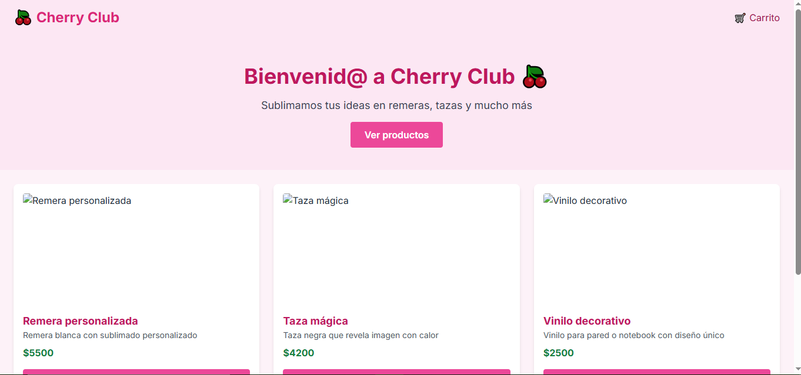

# 🍒 Cherry Club — Tienda online de productos personalizados

Bienvenid@ a **Cherry Club**, tu tienda de confianza para productos personalizados con amor: remeras, tazas, stickers y más. Esta es la versión frontend de la tienda desarrollada en **React + Vite + Tailwind CSS**.

---

## ✨ Tecnologías utilizadas

- ⚛️ **React** — Librería para interfaces modernas
- ⚡ **Vite** — Compilador súper rápido
- 🎨 **Tailwind CSS** — Framework de estilos con clases utilitarias
- 🔃 **React Router DOM** — Navegación SPA
- 📦 **Context API** — Carrito de compras

---

## 📦 Instalación y ejecución local

1. Cloná el repositorio:

```bash
git clone https://github.com/tu-usuario/cherry-club.git
cd cherry-club
```

2. Instalá las dependencias:

```bash
npm install
```

3. Ejecutá la app:

```bash
npm run dev
```

Abrí tu navegador en `http://localhost:5173`

---

## 🛍️ Funcionalidades

- 📃 Catálogo de productos desde JSON
- 🧩 Vista detallada de producto
- 🛒 Carrito con cantidad y total
- 💳 Checkout con opción de transferencia y soporte para MercadoPago
- 📱 Responsive y listo para dispositivos móviles

---

## 🚀 A futuro

- Backend con Node + Express para integrar MercadoPago
- Panel de administración
- Integración con base de datos

---

## 📸 Vista previa




---

## 🧑‍💻 Autor

Desarrollado con 💖 por [Camilo Quiroga](https://github.com/camiloquirogadev)

Instagram del emprendimiento:  
📸 [@tienda.cherry.club](https://www.instagram.com/tienda.cherry.club/)

---

## 📬 Contacto

Si querés colaborar, aportar ideas o reportar errores, podés abrir un issue o escribirme por DM.